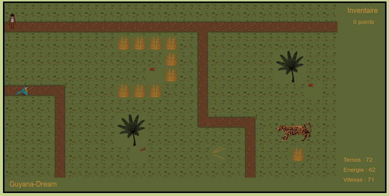
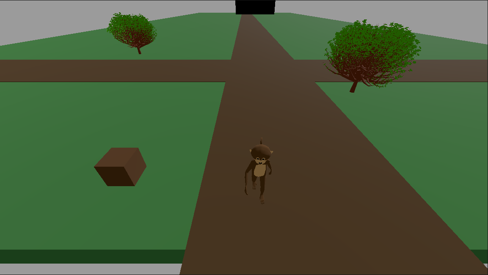

# Guyana-Dream-Godot
Ça part du jeu en 2D [Guyana-Dream](http://usf.tuxfamily.org/guyana-dream/) que j'ai codé avec javascript pour le transformer en jeu 3D fait avec Godot.

Je commence par suivre le tuto ["Learn to make First 3D game in Godot 4 - Complete Tutorial Beginner Friendly"](https://www.youtube.com/watch?v=A3R6T1h0ln8&t=2s) de la chaîne CyberPotato  en remplaçant les objets par mes assets 3D persos créées avec Blender.

